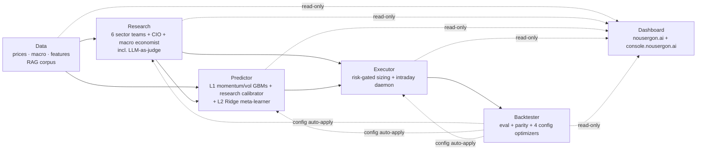
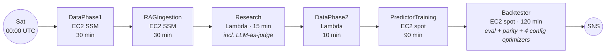
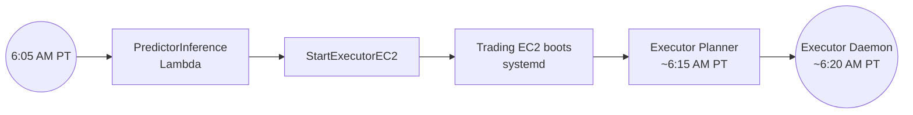
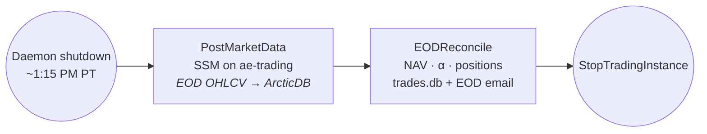

# Crucible — Alpha Engine

> Part of [**Crucible**](https://nousergon.ai) — a [Nous Ergon](https://nousergon.ai) product: a harness for rigorous AI/ML experiments in finance, an equity research-and-trading system instrumented end-to-end. Repo and S3 names use the underlying project codename `alpha-engine`.

System-overview entry point. Detailed module documentation, blog posts, the live dashboard, and metrics validation live on the public site.

**[nousergon.ai](https://nousergon.ai)** · **[Blog](https://nousergon.ai/blog)** · **[Modules](#modules)** · **[Architecture](#system-architecture)**

---

## What this is

A multi-agent orchestration system that researches, decides, and acts — and measures and tunes itself in the process. Equities trading is the substrate: a domain where decisions are unambiguous, outcomes are continuously verifiable, and agentic behavior is observable end-to-end.

Four capabilities define the system:

- **Multi-agent orchestration** — six LangGraph sector teams, a CIO, and a macro economist scan the S&P 500+400 (~900 stocks) weekly. Each sector team runs a quant ReAct → qual ReAct → peer review flow before submitting 2–3 recommendations. The CIO gates new entrants per a configurable cap. Outputs at key stages are evaluated by a rubric-based LLM-as-judge layer.
- **Stacked meta-ensemble prediction** — three specialized Layer-1 models (LightGBM momentum, LightGBM volatility, and a research-score calibrator) feed a Layer-2 Ridge meta-learner alongside research-context and raw macro features. Predictions flow into a downstream risk-gated executor.
- **Autonomous self-improvement** — a backtester evaluates the system's own outputs each week, runs parameter sweeps, and writes four optimized configs back to S3. Research, predictor, and executor read those configs on cold-start; the system retunes itself weekly without manual intervention.
- **End-to-end measurement substrate** — signals are persisted to `research.db` and `signals.json`, predictions to `predictions/{date}.json`, fills to a SQLite trade log backed up to S3, and daily P&L to `eod_pnl.csv`. The presentation layer is a view, not a measurement layer; numbers source from existing module outputs.

The substrate is equities; the pattern is general. The orchestration, measurement, and learning loops apply anywhere multi-agent collaboration and durable instrumentation matter.

## Phase trajectory

| Phase | Focus | Status |
|---|---|---|
| **Phase 1** | Build the system end-to-end | ✅ Complete — 6 modules, 7 public repos, full pipeline running |
| **Phase 2** | Reliability + measurability buildout | 🟡 **Current** — pipeline reliability, every decision point measurable, autonomous feedback loop |
| **Phase 3** | Parameter tuning toward alpha | ⏳ Next — operates on the substrate Phase 2 is making trustworthy |
| **Phase 4** | Live capital | ⏳ Gated on sustained Phase 3 outperformance |

Per-phase key objectives, the Phase 2 → 3 transparency-inventory gate, and Phase 3 → 4 alpha gating live on the [nousergon.ai home page](https://nousergon.ai) (canonical source). Forward-looking work tracking lives in [ROADMAP.md](ROADMAP.md).

## Modules

| Module | Repo | Today |
|---|---|---|
| **Data** | [`alpha-engine-data`](https://github.com/nousergon/nousergon-data) | ~50 features × ~900 tickers × 10y in ArcticDB; weekly refresh + daily delta |
| **Research** | [`alpha-engine-research`](https://github.com/nousergon/crucible-research) | 6 sector teams + CIO + macro economist; weekly scan; rubric-based LLM-as-judge on key stages |
| **Predictor** | [`alpha-engine-predictor`](https://github.com/nousergon/crucible-predictor) | Layer-1 LightGBM momentum + LightGBM volatility + research-score calibrator → Layer-2 Ridge meta-learner; 21 features in production inference |
| **Executor** | [`alpha-engine`](https://github.com/nousergon/crucible-executor) | Risk-gated paper trading via IB Gateway; 4 entry-trigger types; ATR trailing stops |
| **Backtester** | [`alpha-engine-backtester`](https://github.com/nousergon/crucible-backtester) | Weekly evaluator + autonomous optimizers writing 4 configs to S3 (scoring weights, executor params, predictor veto, research params) |
| **Dashboard** | [`alpha-engine-dashboard`](https://github.com/nousergon/crucible-dashboard) | Read-only Streamlit; powers nousergon.ai (public) and console.nousergon.ai (private, Cloudflare Access) |

Plus two supporting repos: a public shared library [`alpha-engine-lib`](https://github.com/nousergon/nousergon-lib) (logging, freshness gates, trading-calendar arithmetic, ArcticDB helpers, agent decision capture, LLM cost tracking) used by all 6 modules, and a private [`alpha-engine-config`](https://github.com/nousergon/alpha-engine-config) repo holding proprietary scoring weights, agent prompts, model parameters, and other tuned values. Disclosure boundary: architecture and approach are public; specific weights, prompts, and thresholds are private.

## System architecture

Module-level data flow. Three Step Functions — weekly, weekday morning, and EOD — orchestrate the modules; per-pipeline orchestration diagrams follow.

### Weekly pipeline — `alpha-engine-saturday-pipeline`

EventBridge `cron(0 0 ? * SAT *)` — Sat 00:00 UTC (Fri 5–8 PM PT).

### Weekday morning pipeline — `alpha-engine-weekday-pipeline`

EventBridge `cron(5 13 ? * MON-FRI *)` — 6:05 AM PT.

The daemon runs through the trading day, executing urgent exits at open and timing entries via intraday triggers (pullback, VWAP, support, time-expiry). Daemon shutdown after close (~1:15 PM PT) triggers the EOD pipeline.

### EOD pipeline — `alpha-engine-eod-pipeline`

Triggered by daemon shutdown — single authoritative path, no redundant cron.

## License

AGPL-3.0-only — see [LICENSE](LICENSE). Commercial licenses available — contact brian@nousergon.ai.
